# DNA Methylation Analysis Pipeline (R & Python) 🧬

Hi there! 👋 Welcome to my DNA methylation analysis repository.

I built this pipeline to process, analyze, and visualize DNA methylation microarray data (Illumina Infinium 450k/EPIC). Because computational reproducibility is crucial in bioinformatics, I developed the primary workflow in **R (Bioconductor)** and independently replicated the exploratory and Quality Control (QC) steps in **Python**.

This dual-language approach ensures that the results are robust and not just an artifact of a specific programming environment.

---

## 🚀 What This Pipeline Does

The workflow is broken down into 13 practical tasks, covering everything from raw data parsing to functional enrichment:

1. **Data Loading & Prep:** Parsing raw `.idat` files and splitting data into Red/Green channels using `minfi`.
2. **Quality Control (QC):** Checking sample integrity, background noise (Negative Controls), and identifying failed probes ($p > 0.01$).
3. **Normalization:** Applying Quantile Normalization (`preprocessQuantile`) to clean up technical batch effects.
4. **Exploratory Analysis (PCA):** Running Principal Component Analysis to see how samples cluster based on Group, Sex, and Batch/Slide.
5. **Differential Methylation:** Using `limma` to fit linear models on M-values and find Differentially Methylated Probes (DMPs).
6. **Visualization:** Plotting the results using Beta/M-value density charts, Volcano plots, Manhattan plots, and Heatmaps.
7. **Pathway Analysis:** Running Gene Ontology (GO) Enrichment to see what biological pathways are actually affected by the DMPs.

---

## 📂 Project Structure
```text
DNA-Methylation-Pipeline/
│
├── R/
│   └── Rmarkdown_final_maybe.Rmd     # The main analysis pipeline (R/Bioconductor)
│
├── Python/
│   └── drd_py.ipynb                  # Replication of QC & EDA steps (Python)
│
├── results/                          # Where all the magic happens (Generated plots)
│   ├── Task5_QCplot.png
│   ├── Task5_NegativeControls.png
│   ├── Task6_MeanDensities.png
│   ├── Task7_6PanelPlot.png
│   ├── Task8_PCA_Batch.png
│   ├── Task8_PCA_Group.png
│   ├── Task8_PCA_Sex.png
│   ├── Task11_ManhattanPlot.png
│   ├── Task11_VolcanoPlot.png
│   ├── Task12_Heatmap_Top100.png
│   └── Task13_GO_Enrichment.png
│
└── .gitignore                        # Keeping heavy .idat files out of the repo
```

---

## 🛠️ Tech Stack

* **R / Bioconductor:** `minfi`, `limma`, `gplots`, `qqman` (Great for hardcore statistical modeling and standard microarray analysis).
* **Python:** `pandas`, `numpy`, `matplotlib`, `seaborn` (Great for data wrangling and clean, custom visualizations).

---

## 📈 Visualizing the Results

Here is a quick look at the output generated by the pipeline:

### 1. Are the samples good? (QC)
All samples passed the diagnostic thresholds, showing optimal hybridization and normal background noise.
| QC Plot | Background Signal (Negative Controls) |
|---|---|
| 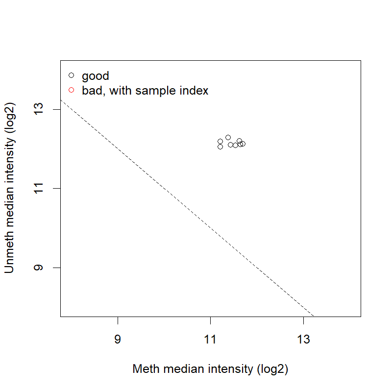 | 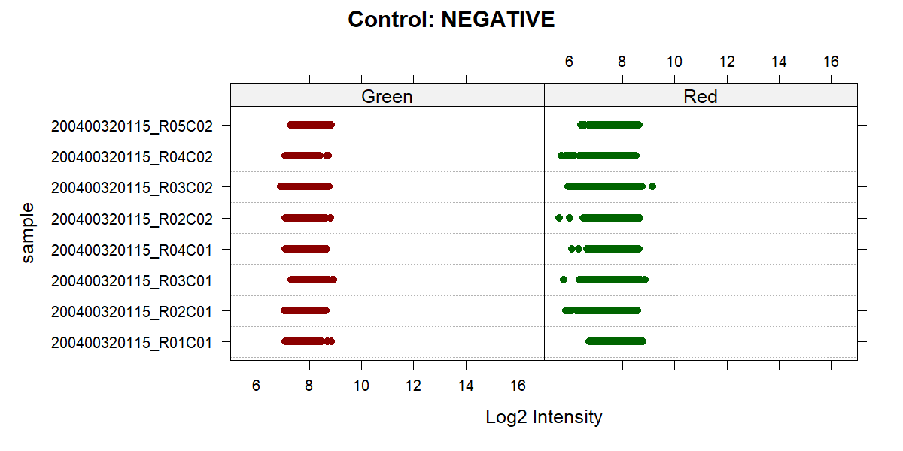 |

### 2. Normalization & Data Distribution
Checking the classic biological bimodal distribution of Beta values before and after quantile normalization.
| Mean Beta Densities | Normalization (6-Panel) |
|---|---|
| 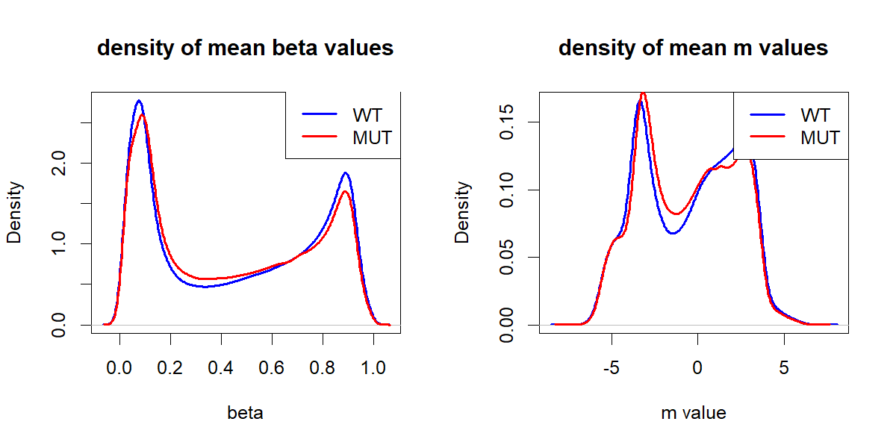 | 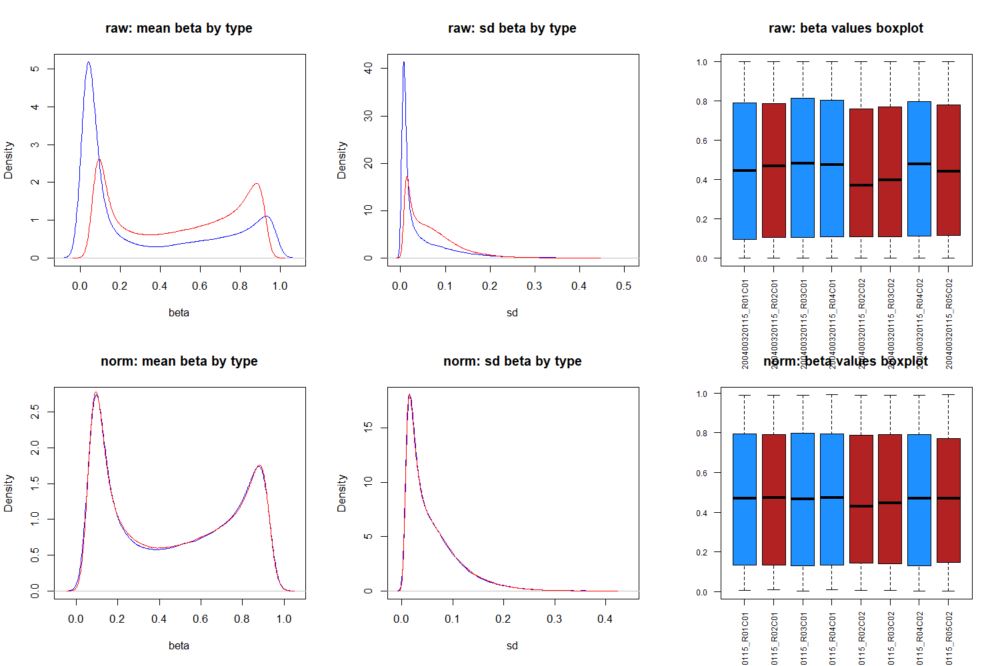 |

### 3. Finding Batch Effects (PCA)
Mapping the top variations. We checked if the samples separate by their biological group, patient sex, or technical batches.
| By Group | By Patient Sex | By Slide/Batch |
|---|---|---|
| 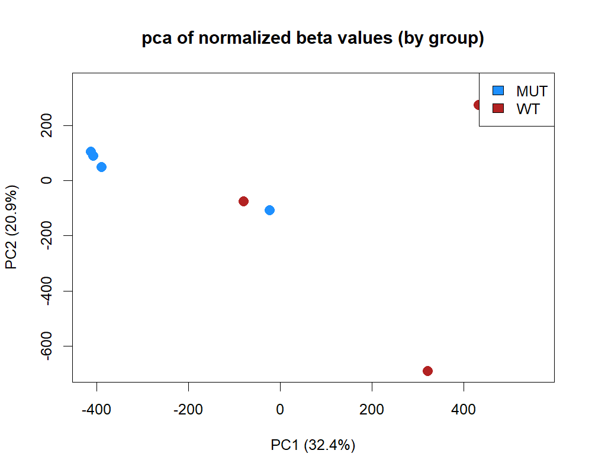 | 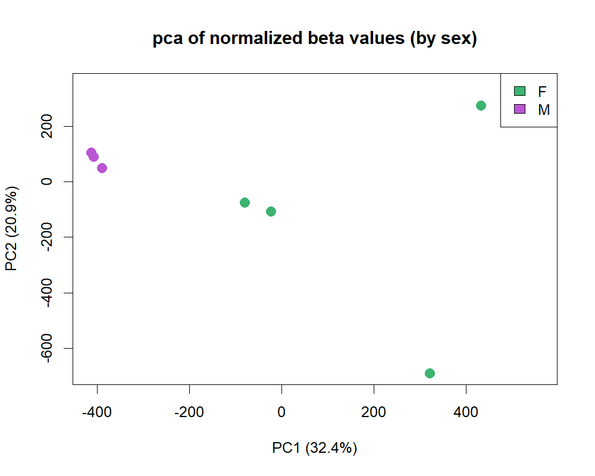 | 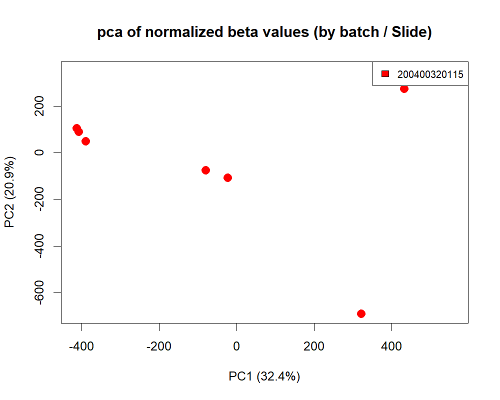 |

### 4. Differentially Methylated Probes (DMPs)
Highlighting the most significantly altered CpG sites across the epigenome.
| Volcano Plot | Manhattan Plot |
|---|---|
| 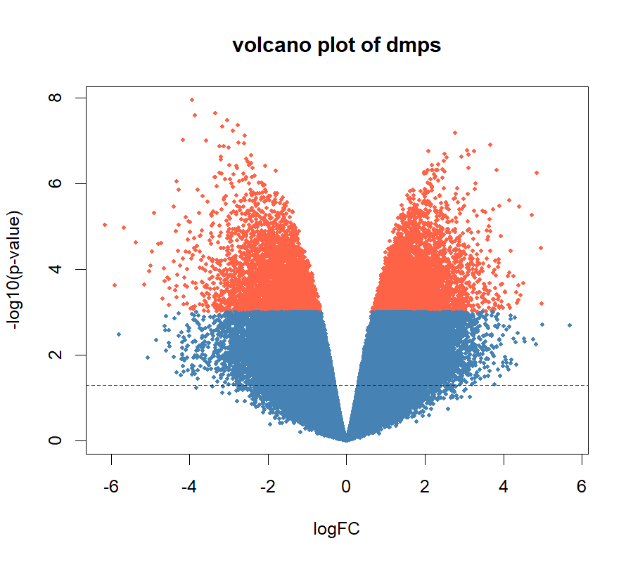 | 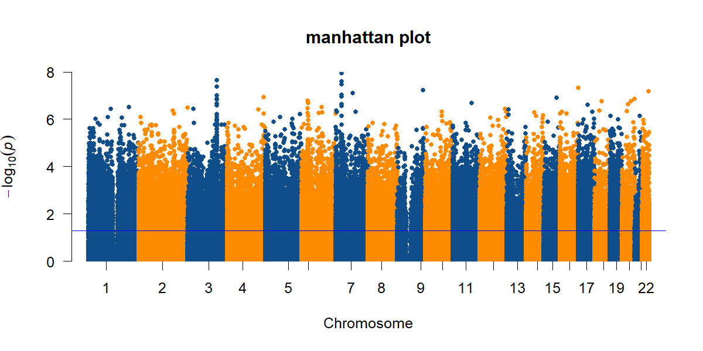 |

### 5. Biological Impact (Heatmap & GO Enrichment)
Clustering the top 100 DMPs to see the patterns, and mapping them to biological pathways to understand what it all means.
| Top 100 DMPs Heatmap | GO Enrichment |
|---|---|
| 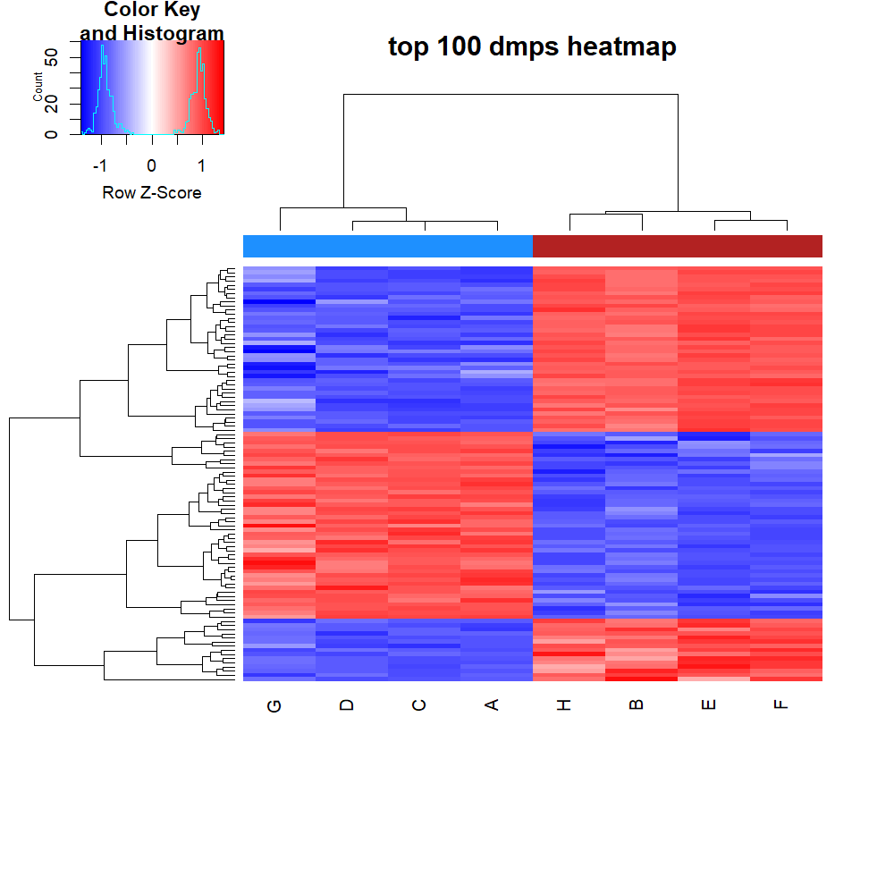 | 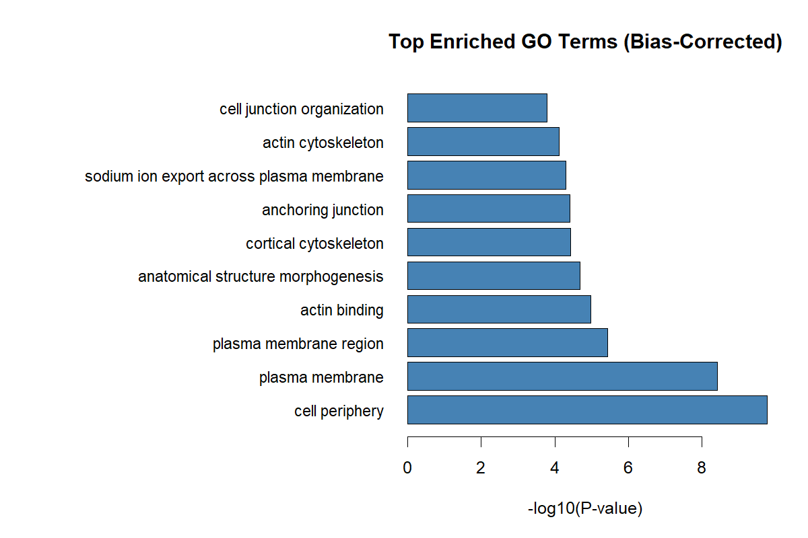 |

---

## 🧑‍💻 About Me
I'm **Mohammadamin Roshan**, a Bioinformatics Master's student at the University of Bologna. I am passionate about omics data analysis, Python/R programming, and reproducible research.

* **Let's connect:** [Insert your LinkedIn link here]
* **Email:** mohammadamin.roshan@studio.unibo.it
